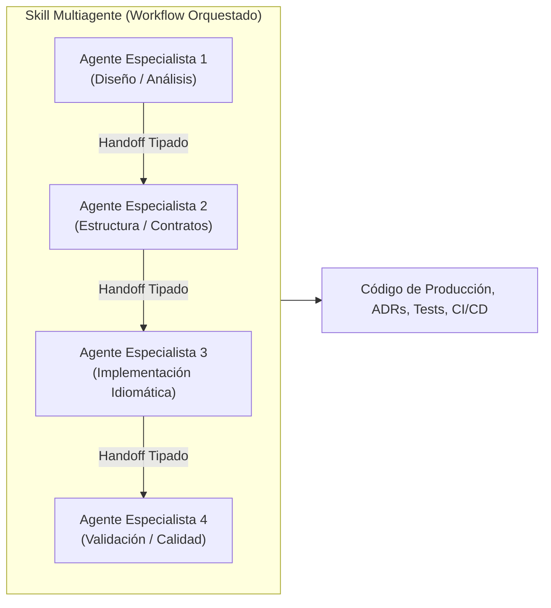
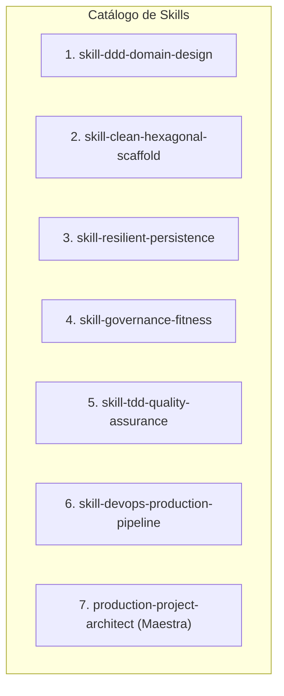
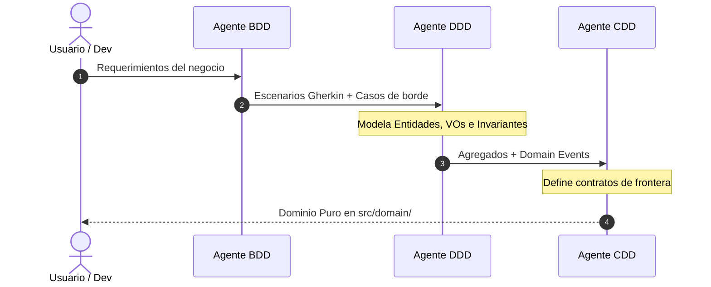
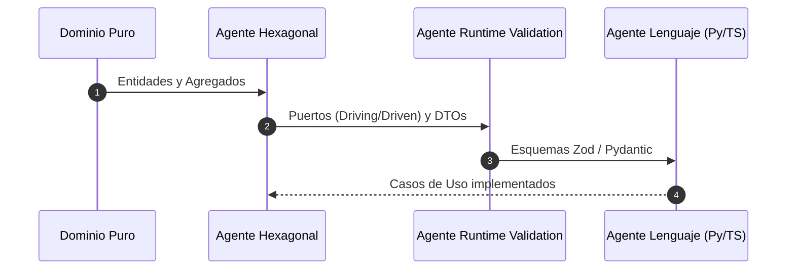
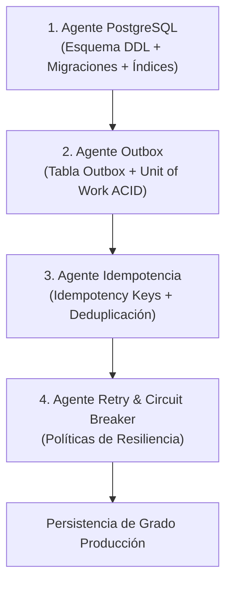
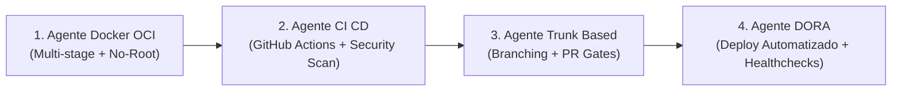
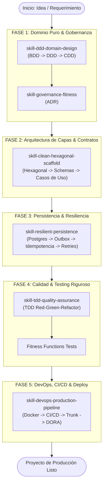

# CATÁLOGO DE SKILLS Y ORQUESTACIÓN MULTIAGENTE

Este documento formaliza el catálogo de **Skills de Ingeniería y Arquitectura de Software** derivadas de las especificaciones de agentes de esta bóveda. Define **qué hace cada skill, cómo funciona, qué agentes ejecuta, en qué orden estricto operan y en qué parte del proyecto se implementan**.

---

## 1. Arquitectura de Ejecución Multiagente

Una **Skill Multiagente** es un workflow determinístico compuesto por una cadena de agentes especialistas. Ningún agente salta etapas ni asume responsabilidades ajenas a su rol:

### Reglas de Interacción y Handoff
1. **Paso de Testigo (Handoff) Unidireccional:** Cada agente consume la salida del anterior, valida que cumpla su *Definition of Done* y genera su artefacto antes de delegar.
2. **Aislamiento de Responsabilidad:** El agente de Dominio no toca frameworks; el de Lenguaje no altera las reglas de negocio; el de DevOps no modifica el código fuente de aplicación.
3. **Inmutabilidad de Invariantes:** Las decisiones registradas por los agentes de diseño (DDD / Clean) son vinculantes para los agentes de implementación.

---

## 2. Catálogo Detallado de Skills

---

### Skill 1: `skill-ddd-domain-design`
* **Tipo:** Multiagente (Secuencial de 3 fases)
* **Objetivo:** Modelar el corazón del negocio (Dominio Puro) sin contaminación de frameworks, bases de datos ni UI.
* **Dónde se implementa en el proyecto:** `src/domain/` (Entidades, Value Objects, Agregados, Eventos de Dominio, Excepciones de Negocio).

#### Cadena de Agentes y Orden de Ejecución:
1. **`Agente BDD` (Pilar 01):**
   * *Entrada:* Requerimientos funcionales del usuario.
   * *Acción:* Escribe los escenarios en formato Gherkin (`Given-When-Then`) especificando el comportamiento esperado y los casos de borde.
   * *Salida:* Archivos `.feature` o especificaciones ejecutables en `tests/bdd/`.
2. **`Agente DDD` (Pilar 01):**
   * *Entrada:* Escenarios BDD y glosario del negocio.
   * *Acción:* Modela Agregados, Entidades y Value Objects inmutables. Protege las invariantes con validaciones en construcción y métodos de mutación explícitos.
   * *Salida:* Clases de dominio y eventos en `src/domain/model/` y `src/domain/events/`.
3. **`Agente CDD` (Pilar 01):**
   * *Entrada:* Eventos y operaciones del Agregado.
   * *Acción:* Define los contratos de frontera (interfaces de dominio / DTOs de salida) para comunicación entre Bounded Contexts.
   * *Salida:* Contratos de interfaz en `src/domain/contracts/`.

---

### Skill 2: `skill-clean-hexagonal-scaffold`
* **Tipo:** Multiagente (Secuencial de 3 fases)
* **Objetivo:** Estructurar la arquitectura en capas concéntricas (Puertos y Adaptadores), desacoplando la lógica de aplicación del transporte e infraestructura.
* **Dónde se implementa en el proyecto:** `src/application/` (Casos de Uso, DTOs, Puertos) y `src/infrastructure/` (Adaptadores, Controladores).

#### Cadena de Agentes y Orden de Ejecución:
1. **`Agente Hexagonal` / `Agente Clean Architecture` (Pilar 02):**
   * *Entrada:* Dominio puro generado en `src/domain/`.
   * *Acción:* Diseña los *Driving Ports* (Casos de Uso / Interactors) y los *Driven Ports* (Interfaces de Repositorio, Notificadores, Clientes HTTP).
   * *Salida:* Estructura de carpetas e interfaces abstractas en `src/application/ports/`.
2. **`Agente Runtime Validation` (Pilar 03):**
   * *Entrada:* DTOs de entrada y salida de los Casos de Uso.
   * *Acción:* Define esquemas estrictos de validación en los límites de la aplicación usando Zod (TypeScript) o Pydantic v2 (Python).
   * *Salida:* Esquemas de validación en `src/application/schemas/`.
3. **`Agente [Python / TypeScript]` (Pilar 08):**
   * *Entrada:* Puertos, esquemas y Casos de Uso.
   * *Acción:* Implementa los Casos de Uso idiomáticos con async/await, tipado estricto (`mypy --strict` / `strict: true`) y manejo de errores tipados (Result pattern).
   * *Salida:* Implementación concreta de Casos de Uso en `src/application/use-cases/`.

---

### Skill 3: `skill-resilient-persistence`
* **Tipo:** Multiagente (Secuencial de 4 fases)
* **Objetivo:** Diseñar la persistencia transaccional, esquema de base de datos relacional y patrones de resiliencia ante fallos de red o caídas.
* **Dónde se implementa en el proyecto:** `src/infrastructure/persistence/` y `migrations/`.

#### Cadena de Agentes y Orden de Ejecución:
1. **`Agente PostgreSQL` (Pilar 10):**
   * *Entrada:* Agregados de dominio y driven ports de repositorio.
   * *Acción:* Diseña el esquema relacional normalizado (tablas, claves foráneas, índices B-Tree, constraints) y genera migraciones versionadas.
   * *Salida:* Archivos SQL de migración en `migrations/` y configuración de pool de conexiones.
2. **`Agente Outbox` (Pilar 05):**
   * *Entrada:* Eventos de dominio emitidos por los agregados.
   * *Acción:* Modela la tabla `outbox_events` y la integración con el Unit of Work para persistir estado y eventos en la misma transacción ACID.
   * *Salida:* Tabla y repositorio de Outbox en `src/infrastructure/persistence/outbox/`.
3. **`Agente Idempotencia` (Pilar 05):**
   * *Entrada:* Operaciones de escritura / mutación.
   * *Acción:* Agrega control de claves de idempotencia (`idempotency_key`), persistencia de respuestas previas y detección de reintentos duplicados.
   * *Salida:* Middleware y tabla de idempotencia en `src/infrastructure/persistence/idempotency/`.
4. **`Agente Retry Backoff` & `Agente Circuit Breaker` (Pilar 05):**
   * *Entrada:* Clientes de base de datos y llamadas externas.
   * *Acción:* Envuelve adaptadores con reintentos exponenciales con jitter y cortacircuitos para evitar saturación en fallos transitorios.
   * *Salida:* Wrappers de resiliencia en `src/infrastructure/resilience/`.

---

### Skill 4: `skill-governance-fitness`
* **Tipo:** Multiagente (Secuencial de 2 fases)
* **Objetivo:** Registrar formalmente las decisiones arquitectónicas y blindar la base de código con tests automáticos que impidan la degradación estructural.
* **Dónde se implementa en el proyecto:** `docs/adr/` y `tests/architecture/`.

#### Cadena de Agentes y Orden de Ejecución:
1. **`Agente ADR` (Pilar 04):**
   * *Entrada:* Contexto del proyecto, alternativas evaluadas y decisiones tomadas.
   * *Acción:* Redacta el Architecture Decision Record en formato estándar (Status, Context, Decision, Consequences, Trade-offs).
   * *Salida:* `docs/adr/NNNN-decision-name.md`.
2. **`Agente Fitness Functions` (Pilar 04):**
   * *Entrada:* Reglas de capas estipuladas en el ADR.
   * *Acción:* Escribe tests automatizados (ej. `pytest-archon` o `ts-arch`) que fallan si `domain/` importa `infrastructure/` o frameworks externos.
   * *Salida:* Suites de tests en `tests/architecture/test_layer_boundaries.*`.

---

### Skill 5: `skill-tdd-quality-assurance`
* **Tipo:** Multiagente (Iterativo de 3 fases)
* **Objetivo:** Guiar el desarrollo mediante el ciclo Red-Green-Refactor, garantizando cobertura de invariantes y contratos sin tests frágiles.
* **Dónde se implementa en el proyecto:** `tests/unit/`, `tests/integration/` y código fuente.

#### Cadena de Agentes y Orden de Ejecución:
1. **`Agente TDD` (Pilar 01):**
   * *Fase RED:* Escribe un test unitario para un invariante del dominio o caso de uso antes de que exista el código. Ejecuta el test y confirma que falla por la razón correcta.
2. **`Agente [Python / TypeScript]` (Pilar 08):**
   * *Fase GREEN:* Escribe el código mínimo e indispensable que hace pasar el test, cumpliendo el tipado estricto.
3. **`Agente Clean Architecture` / `Agente Fitness Functions` (Pilares 02 y 04):**
   * *Fase REFACTOR:* Limpia duplicaciones, extrae Value Objects si emergen conceptos de negocio y valida que no se rompan las dependencias entre capas.

---

### Skill 6: `skill-devops-production-pipeline`
* **Tipo:** Multiagente (Secuencial de 4 fases)
* **Objetivo:** Contenerizar la aplicación de forma segura y automatizar el ciclo de integración y despliegue continuo con métricas DORA.
* **Dónde se implementa en el proyecto:** `Dockerfile`, `docker-compose.yml`, `.github/workflows/` y scripts de deploy.

#### Cadena de Agentes y Orden de Ejecución:
1. **`Agente Docker OCI` (Pilar 11):**
   * *Entrada:* Requisitos de runtime (Python `uv` / Node `pnpm`).
   * *Acción:* Escribe un `Dockerfile` multi-stage con usuario no-root (`USER app`), cacheo de capas de dependencias y tamaño mínimo de imagen final (distroless o alpine).
   * *Salida:* `Dockerfile` y `.dockerignore`.
2. **`Agente CI CD Pipeline` (Pilar 11):**
   * *Entrada:* Comandos de linting, testing, typechecking y Dockerfile.
   * *Acción:* Crea el pipeline de GitHub Actions (`ci.yml`) con ejecución paralela de validaciones, build de imagen OCI y escaneo de vulnerabilidades (`trivy`).
   * *Salida:* `.github/workflows/ci.yml`.
3. **`Agente Trunk Based Development` (Pilar 12):**
   * *Entrada:* Estrategia de branching y control de versiones.
   * *Acción:* Configura reglas de protección de rama `main` (requerir CI verde, sin merges directos, PRs de vida corta < 24h).
   * *Salida:* `.github/pull_request_template.md` y reglas de repositorio.
4. **`Agente Continuous Delivery DORA` (Pilar 12):**
   * *Entrada:* Estrategia de despliegue (Blue/Green o Canary).
   * *Acción:* Configura telemetría y pipelines de despliegue automatizado hacia staging/producción para maximizar frecuencia de deploy y minimizar MTTR.
   * *Salida:* `.github/workflows/deploy.yml` y healthchecks (`/healthz`, `/ready`).

---

## 3. La Meta-Skill Orquestadora: `production-project-architect`

La skill maestra **`production-project-architect`** es el orquestador global de nivel superior. Ejecuta secuencialmente las skills anteriores a lo largo de 5 fases para entregar un proyecto profesional completo de punta a punta:

---

## 4. Matriz de Agentes por Carpeta en el Proyecto Destino

Esta matriz muestra qué agente es dueño de cada directorio en un proyecto construido con estas skills:

| Directorio / Archivo | Agente(s) Responsable(s) | Skill que lo Gobierna |
| :--- | :--- | :--- |
| `docs/adr/*.md` | `Agente ADR` | `skill-governance-fitness` |
| `tests/bdd/*.feature` | `Agente BDD` | `skill-ddd-domain-design` |
| `src/domain/model/*` | `Agente DDD` | `skill-ddd-domain-design` |
| `src/domain/events/*` | `Agente DDD`, `Agente Outbox` | `skill-ddd-domain-design` |
| `src/application/ports/*` | `Agente Hexagonal`, `Agente CDD` | `skill-clean-hexagonal-scaffold` |
| `src/application/schemas/*` | `Agente Runtime Validation` | `skill-clean-hexagonal-scaffold` |
| `src/application/use-cases/*` | `Agente [Python/TypeScript]` | `skill-clean-hexagonal-scaffold` |
| `src/infrastructure/persistence/*` | `Agente PostgreSQL`, `Agente Outbox` | `skill-resilient-persistence` |
| `src/infrastructure/resilience/*` | `Agente Circuit Breaker`, `Agente Retry` | `skill-resilient-persistence` |
| `tests/architecture/*` | `Agente Fitness Functions` | `skill-governance-fitness` |
| `Dockerfile`, `.dockerignore` | `Agente Docker OCI` | `skill-devops-production-pipeline` |
| `.github/workflows/*.yml` | `Agente CI CD Pipeline`, `Agente DORA` | `skill-devops-production-pipeline` |

---

## 5. Definition of Done (DoD) de un Proyecto de Producción

Un proyecto ejecutado bajo esta orquestación se considera terminado únicamente cuando:
- [ ] **Dominio Puro:** Cero importaciones de frameworks o infraestructura en `src/domain/`.
- [ ] **Contratos Validados:** Todas las entradas a Casos de Uso pasan por esquemas Zod o Pydantic v2.
- [ ] **Persistencia ACID:** Tablas con constraints reales, índices adecuados y tabla Outbox configurada si hay eventos.
- [ ] **Tests Verdes:** Suites de BDD, TDD unitarias, integración de base de datos y Fitness Functions pasando al 100%.
- [ ] **Seguridad & Contenedores:** Dockerfile multi-stage ejecutando bajo usuario no-root.
- [ ] **CI/CD Automatizado:** Pipeline de GitHub Actions ejecutando lints, typechecks, tests y escaneo de vulnerabilidades.
