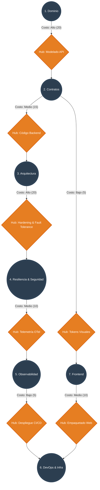

# MAPA CONCEPTUAL: RUTEO DINÁMICO CON HUBS TRANSICIONALES (DIJKSTRA)

En lugar de un pipeline secuencial estricto, la Bóveda opera como un grafo ponderado. Los **Hubs** ya no solo agrupan skills estáticas dentro de una fase, sino que actúan como "Peajes" o "Gateways" de transición entre los Pilares. 

Cada transición tiene un "Costo" algorítmico (basado en consumo de tokens, tiempo de ejecución de las skills y riesgo de la operación). El Agente Orquestador utiliza lógica de caminos mínimos (Algoritmo de Dijkstra) para decidir la ruta más eficiente para llevar un requerimiento a producción, esquivando pilares innecesarios.

## Grafo de Transición de Estados

## ¿Cómo funciona el cálculo de Dijkstra en este flujo?

Si el sistema recibe un requerimiento, el Orquestador evalúa los pesos del grafo:

**Escenario A: "Agregar un nuevo módulo de pagos"**
* Requiere Dominio (P1) -> Contratos (P2) -> Arquitectura (P3) -> Seguridad & Resiliencia (P4) -> Observabilidad (P5) -> DevOps (P6).
* **Costo Total:** 20 + 15 + 20 + 10 + 5 = **70**. Ruta integral de producción, se despliegan los especialistas de backend y hardening.

**Escenario B: "Cambiar el color del botón principal y tipografía"**
* El Orquestador detecta que no hay mutación de datos ni backend. El costo de pasar por P1, P3, P4 y P5 es innecesario.
* Entra por Contratos UI (P2) -> Hub Tokens Visuales (Costo 5) -> Frontend (P7) -> Hub Empaquetado Web (Costo 10) -> DevOps (P6).
* **Costo Total:** 5 + 10 = **15**. 
* **Resultado:** El sistema toma el atajo (shortest path). Se ahorra el tiempo y los tokens de despertar a los agentes de persistencia y seguridad profunda.
